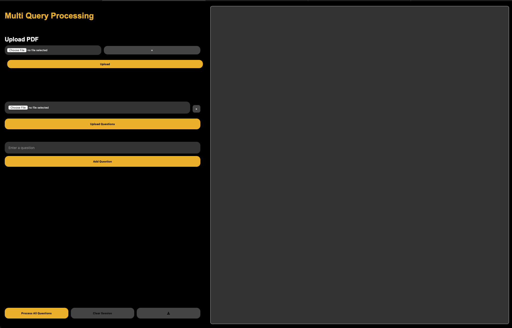
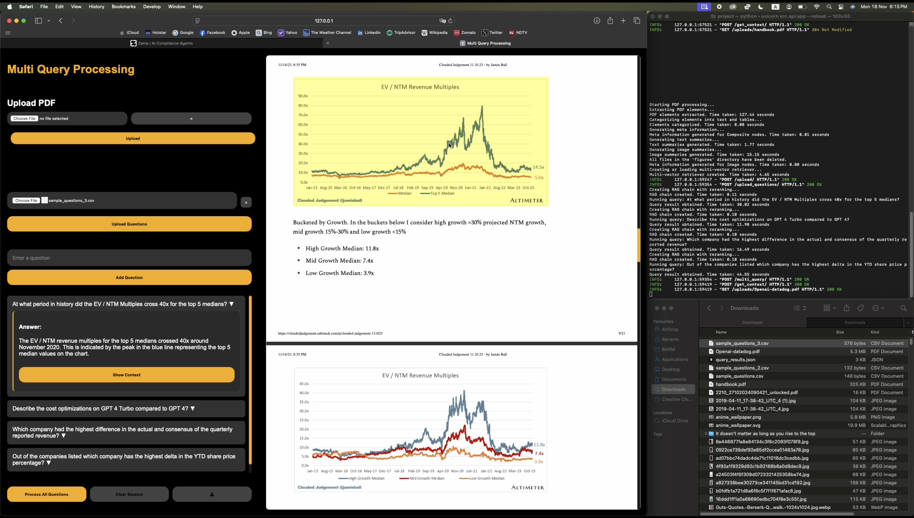

# Multi-query Multi-modal Rag powered Doc-GPT

## How to Install

### a. Install via Virtual Environment

1. **Create a virtual environment:**
    ```bash
    python -m venv test_env
    ```

2. **Activate the virtual environment:**
    - On Windows:
        ```bash
        test_env\Scripts\activate
        ```
    - On macOS/Linux:
        ```bash
        source test_env/bin/activate
        ```

3. **Install the dependencies:**
    ```bash
    pip install -r requirements.txt
    ```
4. **Set up OpenAI API key:**
    ```bash
    export OPENAI_API_KEY=your_openai_api_key_here
    ```

5. **Run the application:**
    ```bash
    uvicorn src.api:app --reload
    ```


### b. Install via Dockerfile

1. **Update the Dockerfile with the correct OpenAI API key:**
    - Open the Dockerfile and add the following line with your OpenAI API key:
        ```dockerfile
        ENV OPENAI_API_KEY=your_openai_api_key_here
        ```

2. **Build the Docker image:**
    ```bash
    docker build -t multimodal-rag-doc-gpt .
    ```

3. **Run the Docker container:**
    ```bash
    docker run -p 8000:8000 multimodal-rag-doc-gpt
    ```

## How to Use
Here is a video demo on usage of the application after setting up the environment as mentioned above: [Video Demo](https://drive.google.com/file/d/1nlfhX9eIif6VKsDvsO37XvT0W8c_wHmX/view?usp=sharing).

- Since there is document layout analysis with YOLO, the time taken to index a document can be long.
- For a document of 21 pages, it took around 150 seconds.
- You can skip directly to 3 minutes to see the document getting completely processed.
- At the 5th minute, all the questions are processed.

1. **Open the Application:**
    - Open your web browser and navigate to `http://localhost:8000/static/multi_query.html`.
    - you will see the application interface.


2. **Upload a PDF:**
    - Click on the "Choose file" button to select a PDF file from your computer.
    - Click the "Upload" button to upload the selected PDF.
    - Once the PDF is uploaded, you will see a green notification card on the top right corner of the screen.
    - At the moment the upload api supports only one pdf per upload. One session can have only one pdf uploaded and queried.
    - Once you start the upload, the document processing starts in the background. After the indexing is complete, you will see a green notification card on the top right corner of the screen. You can also monitor the progress of the indexing in the terminal where you ran the docker container or uvicorn command.

3. **Submit Queries:**
    - Enter your queries one by one in the text box above the Add Question button.
    - Click the Add Question button to add the query to the query list.
    - If you have a csv or xlsx file with the queries, you can upload the file in the "Upload Questions" section. Note that the column name for the queries should be "question" or "questions".
4. **Process All Questions:**
    - After adding multiple questions to the query list, you can click the "Process All Questions" button to submit all the queries at once.
    - The application will process each query sequentially and display the results for each question.
    - Once the answers are generated, you can see the respective results in the question dropdown.

5. **Get Context:**
    - Click the "Get Context" for the question you want to see the context for.
    - On the right side of the screen, you will see the pdf containing the context rendered in the browser.
    - After 0.5s of the pdf being rendered, the pdf will auto scroll to the page containing the context.
    - After 1-1.5 s of the pdf being rendered, the contexts used for the response generation will be highlighted in the pdf.

6. **Download Results:**
    - After processing your queries, you can download the results.
    - Click on the download icon next to the "Clear Session" button, and a JSON file containing the results will be downloaded.
    - Here is a reference file for the downloaded results: [Reference Results](./query_results.json)


7. **Example Attachment:**
    - Here is an example of how the application interface looks when a PDF is uploaded and processed:
    

## Here is a good example of how the application works

1. **Example:**
    - This was the query: "At what period in history did the EV / NTM Multiples cross 40x for the top 5 medians?" and the pdf used is at [Openai-datadog.pdf](./uploads/Openai-datadog.pdf)
    - Not only was the application able to fetch and highlight the relevant context from the pdf, but the response generated was also very good.
    

4. **Contextual Retrieval:**
    - The Multivector retriever indexes summaries and returns raw images or texts, providing accurate and contextually relevant responses to user queries.

5. **Multi-Modal Multi-Query Processing:**
    - The system processes queries by considering all available contexts, including text, images, and tables, to generate comprehensive responses.
    - The system generates multiple queries to encapsulate the user's intent and the context to generate more accurate responses.

6. **PDF Context Highlighting:**
    - When fetching context from PDFs, the relevant sections are highlighted and the PDF auto-scrolls to the page containing the context, enhancing the user experience.


## How the Backend Works

1. **PDF Processing:**
    - The PDF is processed using the `extract_pdf_elements` function to extract elements such as text, tables, and images.
    - This algorithm uses [`unstructured`](https://docs.unstructured.io/open-source/core-functionality/overview) library to extract the elements from the pdf. It uses `yolox` as the object detection model to detect the elements in the pdf.

2. **Categorizing Elements and Generating Metadata:**
    - The extracted elements are categorized into composite texts and table texts.
    - The elements are categorized into composite texts and table texts based on the `unstructured` library's default categories. This data is later used to generate metadata for the elements, using which we are able to identify the position of the elements in the pdf and highlight them in the pdf.

3. **Generating Texts, Images and Tables summaries:**
    - The elements are summarized into texts, images and tables using the `unstructured` library.
    - Instead of using Image embeddings (CLIP) along with text embeddings in the retriever, we plan to generate good and concise summaries for images and tables, which will be used as the text embeddings for the images and tables in the retriever.

4. **Creating or Updating Multi-Vector Retriever:**
    - The retriever indexes summaries and returns raw images or texts.

5. **Generating Response:**
    - The response is generated using the `rag` library.
    - In the rag chain, we invoke the retriever to fetch the top relevant contexts for the query.
    - If there are any images or tables in the contexts, we send the raw images or tables to the gpt-40-mini along with the query to generate the best possible summary that can be fetched from the images or tables.
    - The new contexts list is then re-ranked using the tf-idf vectorizer and cosine similarity.
    - The new re-ranked contexts are then used to generate the response.

## Next Steps to be Done

### AI Application Enhancements

1. **Implement Measures of Accuracy:**
    - Develop and integrate measures of accuracy based on the RAG triad: answer relevance, context relevance, and groundedness. This will help in evaluating and improving the quality of responses generated by the system. Currently, these measures are not implemented.

2. **Enhance Query Processing:**
    - Improve the multiple query generation to encapsulate the user's intent and the context to generate more accurate responses. If there is a certain vertical of documents and questions, we can have an open sourced LLM with 1-7B parameters (ollama) to generate the queries specific to the vertical, which will improve the accuracy of the context retrieval.
    - Add entity resolution enhanced RAG improvement which can help store the data by converting pronouns into entity names, which can help while retrieving the entity chunks.

3. **Prompt Configurations:**
    - Improve the prompt engineering for the image and table summarization, and generation of response.
    - Have all the prompts configurable from one place.

4. **Implement Guardrails:**
    - Implement guardrails to prevent the application from hallucinating.
    - Implement guardrails to prevent the application from generating harmful or biased responses.
    - Implement guardrails to prevent the application from generating responses that are not relevant to the query.

5. **Reranking Contexts and Answers:**
    - Develop a better algorithm to use multiple context vectors together, which come from the contexts of different queries generated from the multiple query generator chain, to provide a more comprehensive response.
    - Enhance the re-ranking of contexts to ensure the most relevant information is prioritized in the response generation.

### Engineering Optimization

1. **Optimize Performance:**
    - Optimize the backend processing to multiple PDFs and multiple queries parallelly.
    - Options to select and delete or add new queries and process them individually.
    - Overall improve the performance of the application by optimising for the GPU usage and memory, while refactoring the code to be more efficient.


### Frontend UX Optimization (Current State is surely crappy)

1. **Improve PDF Rendering:**
    - Ensure the PDF is perfectly readable on the browser, and the text can be selected and copied.

2. **Display Dashboard:**
    - Display the dashboard with the uploaded PDFs and their info.

3. **Multi-Document Context Rendering:**
    - If multiple documents are needed to answer the query, render the context of multiple documents and display them in the browser.
